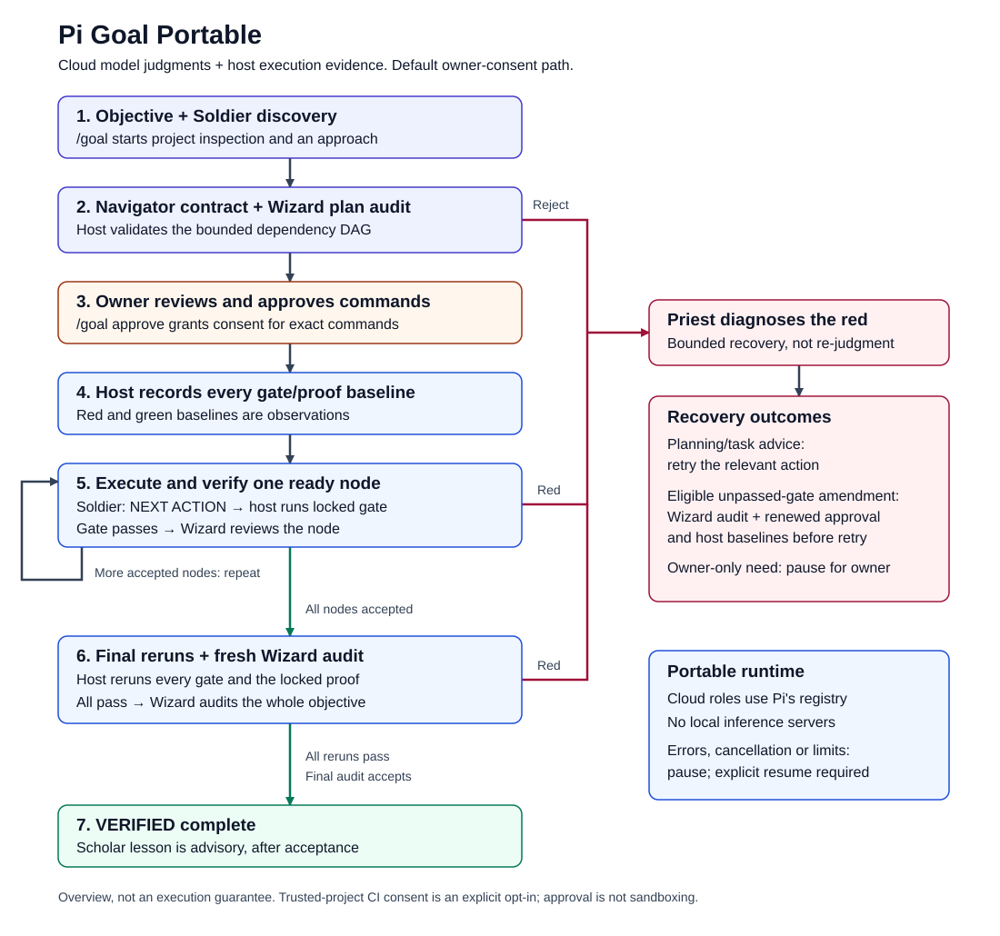

# Pi Goal Portable

A shareable, cloud-native [/goal workflow for Pi](https://pi.dev): reviewed plans,
host-run verification gates, bounded recovery and an animated terminal HUD.

**Maintained by:** [krump3t](https://github.com/krump3t)  
**Installable package:** [pi-goal-portable/](pi-goal-portable/)

## From objective to verified result



[Diagram details and editable source](pi-goal-portable/00_system/diagrams/README.md).

| Role | Responsibility |
|---|---|
| Soldier | Inspects the project and implements the next ready action |
| Navigator | Builds acceptance criteria and a bounded dependency plan |
| Wizard | Reviews the plan, each node and the final result in fresh contexts |
| Priest | Diagnoses red outcomes and proposes bounded recovery |
| Scholar | Records an advisory lesson after final acceptance |

These are workflow roles, not five installations. By default, they use your
selected Pi cloud model; per-role overrides are optional. The host executes
verification commands and records their outcomes. Worker claims alone do not
certify completion: all gates, the locked proof and final review must pass.

## Prerequisites

- **Node.js 22.19+** and **Pi 1.1.0** or an API-compatible version
- Pi using the **`@earendil-works`** package namespace
- Internet access and an authenticated cloud chat model with tool calling
- Pi's Bash/read tools, a working Bash environment and a writable target project
- Dependencies needed by your project's verification commands
- An interactive terminal for the HUD; RPC/print modes have no animation

No GPU, local model server, MCP server or extra daemon is required.
Git is needed for cloning; Python 3 is only needed to build shareable ZIPs.

## Install

```bash
npm install -g --ignore-scripts @earendil-works/pi-coding-agent
git clone https://github.com/krump3t/pi-goal-portable.git
cd pi-goal-portable
pi install ./pi-goal-portable
```

Keep the clone available: local installation references its nested package folder.
The repository root is the landing page, not the installable package.
For a downloaded package ZIP, extract it and install the extracted package folder.
Do not load another extension registering `/goal` or `goal_update` alongside this one.

## Start your first goal

Start Pi **inside the project you want to modify**, then:
1. `/login` — authenticate with your provider.
2. `/model` — choose a cloud model.
3. `/goal <objective>` — inspect the proposed plan and exact verification commands.
4. `/goal approve` — authorize the reviewed commands and host baselines.

Controls: `/goal status`, `/goal pause`, `/goal resume`, `/goal cancel`.
After session restoration, resume and command approval are explicit.
Red baselines are observations, not failed completion checks. Later gate/review
failures go to Priest; errors, exhausted limits and owner-only needs pause.

## Configuration, artwork and safety

Configuration is optional; see the [guide](pi-goal-portable/00_system/CONFIGURATION.md)
and [example](pi-goal-portable/00_system/goal.config.example.json).
The HUD uses **AI-authored geometric pixel sprites defined directly in code**.
No image-generation model or third-party sprite packs were used for this skin.
The workflow diagram is also AI-authored. Set `animation: false` to disable the HUD.

**Approval is not sandboxing.** Commands execute with your permissions.
Project content and selected evidence go to your cloud provider. Use disposable
workspaces, permission controls and provider spending limits; never commit secrets.

## Documentation and verification

- [Package guide](pi-goal-portable/README.md) — operation and installation
- [Agent contract](pi-goal-portable/AGENTS.md) — maintenance and validation hierarchy
- [Governance](pi-goal-portable/00_system/README.md) — architecture and ACLSD contract
- [Fixtures](pi-goal-portable/01_raw/README.md) — deterministic test inputs
- [Runtime](pi-goal-portable/02_app/README.md) — component, role, HUD and skill map
- [Operations](pi-goal-portable/03_ops/README.md) — audits, tests and packaging
- [Archive](pi-goal-portable/99_archive/README.md) — quarantined materials

From the repo root: `npm --prefix pi-goal-portable run verify`.
**44 offline tests** and scripted real-Pi integration passed. Live cloud execution
and terminal appearance require your own smoke test; see the
[validation receipt](pi-goal-portable/00_system/VALIDATION.md).

## Licensing

Currently **UNLICENSED**; no general public license is granted.
See [provenance and licensing](pi-goal-portable/00_system/NOTICE.md).
